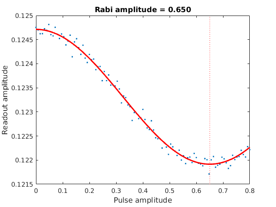
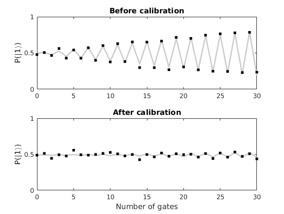
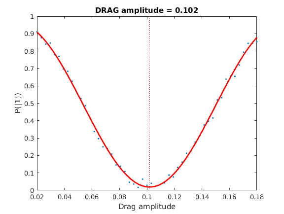
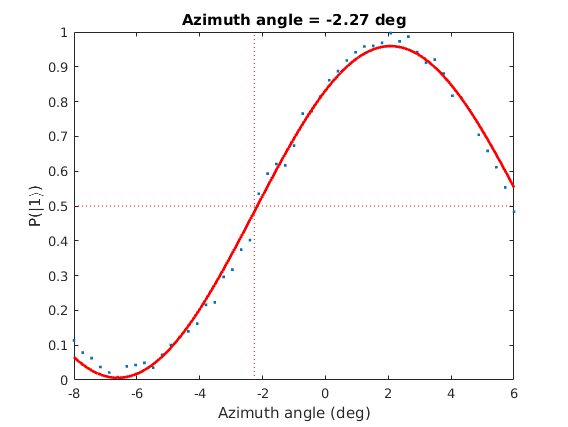

# Single qubit gate calibration and randomized benchmarking procedure

## References
- [QuTiP simulation](https://github.com/zhanggy2004/HouckLabNotebooks/blob/master/QuTiP/GateTuneup.ipynb)

## Table of contents

## Rabi experiement

## Frequency calibration

## Amplitude calibration

## DRAG calibration

## Azimuth calibration

