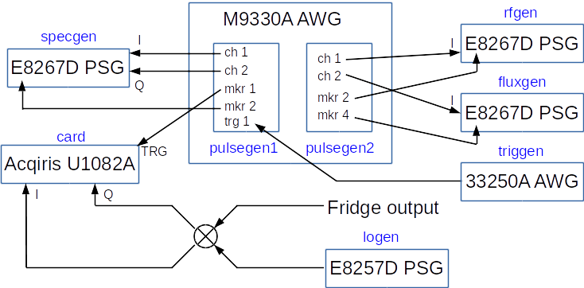
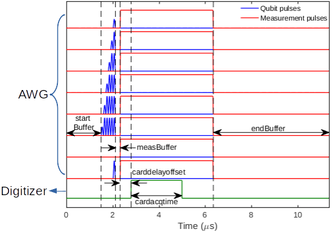

# measlib
A library containing classes for measurements using M9930A AWG and E8267D generators.

See also [single qubit gate calibration and randomized benchmarking procedure](./GateCalib&RB.md).

## Contents
- [Hardware configuration](#hardware-configuration)
- [SmartSweep class](#smartsweep-class)
    - [For users](#for-users)
        - [Setting paremeters](#setting-parameters)
        - [Pulse sequence](#pulse-sequence)
        - [Setting digitizer](#setting-digitizer)
        - [Harware wiring](#hardware-wiring)
        - [Running measurement](#running-measurement)
        - [Plotting data](#plotting-data)
        - [Saving/loading data](#savingloading-data)
    - [For developers](#for-developers)
        - [Pulse timing and generation](#pulse-timing-and-generation)
        - [Setting up sweeps](#setting-up-sweeps)
        - [Adding new sweeps](#adding-new-sweeps)
- [API specifications](#api-specifications)
	- [SmartSweep](#class-smartsweep--handle)
	- [TransSweep](#class-transsweep--smartsweep)
	- [SpecSweep](#class-specsweep--smartsweep)
	- [Rabi](#class-rabi--smartsweep)
	- [T1](#class-t1--smartsweep)
	- [Ramsey](#class-ramsey--smartsweep)
	- [Echo](#class-echo--smartsweep)
	- [RepeatGates](#class-echo--smartsweep)
	- [AmpCal](#class-ampcal--repeatgates)
	- [DragCal](#classs-dragcal--smartsweep)

## Hardware configuration
The figure below shows the default wiring of vector/analogue generators, AWG and acquisition card. The name of matlabs object for each equipment is shown in blue.The AWG **channel 1/2** connects to **wideband I/Q input** ports at the back of E8267D generators. The AWG **marker 2/4** connects to **gate/pulse/trigger input** ports at the front of E8267D generators. **Marker 1 of pulsegen1** connects to the trigger input of acquistion card.



See [M9330A AWG document](../@M9330AWG/README.md#multiple-module-synchronization) for AWG trigger, clock and synchronization settings.

For experiments that require different hardware wiring, see [hardware wiring](#hardware-wiring).
## SmartSweep class
[`SmartSweep`](#class-smartsweep--handle) is an attempt to provide a generic, extensible interface for measurements using E8267D microwave generators and M9330A AWG. In the following, the `SmartSweep` object will be named as `x`.

### For users
For pre-defined measurements such as [`TransSweep`](#class-transsweep--smartsweep), [`SpecSweep`](#class-specsweep--smartsweep), [`Rabi`](#class-rabi--smartsweep), [`T1`](#class-t1--smartsweep), etc., see [example code](../ExampleCode/ExampleCode_measlib.m).

To customize your own measurement:
- For CW measurement, set up the parameters you want to sweep (see discussion below).
- For pulsed measurement, provide `gateseq` and `measseq`, etc. (Usually generated by `pulseCal`)
- Currently supported equipments are listed below.

|Class|Object name|Sweepable parameter|
|-----|-----------|-------------------|
|<br><br><br>E8267DGenerator<br><br><br>|rfgen<br>specgen<br>logen<br>fluxgen<br>rfgen2<br>specgen2<br>logen2|rffreq, rfpower, rfphase<br>specfreq, specpower, specphase<br>lofreq (automatically sweeps with rffreq)<br>fluxfreq, fluxpower, fluxphase<br>rf2freq, rf2power, rf2phase<br>spec2freq, spec2power, spec2phase<br>lo2freq (automatically sweeps with rf2freq)|
|YOKOGS200<br>YOKO7651|yoko1<br>yoko2|yoko1volt<br>yoko2volt|
|<br><br>M9330AWG<br><br>|pulsegen1<br>pulsegen2<br>|gateseq<br>gateseq2<br>measseq<br>measseq2<br>fluxseq|

The objects for instruments **must be declared as global and named** as listed in the second column above.

For E8267D generators and YOKOGAWA voltage sources, sweeping paramters can be scalar, row vector, column vector, or 2D array (see next section for details).

For M9330A AWG's, `gateseq`, `measseq` and `fluxseq` can be an object, or object array of [`pulsegen`](../+pulselib/README.md#contents) classes.

#### Setting parameters
The sweeping parameters can be scalar, row vector, column vector or 2D array. The result is shown in the code and table below.

```matlab
x = measlib.SmartSweep();
x.rfpower = -30;  % scalar: constant in measurement
x.rffreq = [5e9, 5.5e9, 6e9];  % row vector: inner loop
x.specfreq = [3e9; 4e9; 5e9];  % column vector: outer loop
x.specpower = [-10, -5, 0; ... 
               -20, -15, -10; ...
               -30, -25, -20];  % 2D array: both loops
```
||1|2|3|
|--------|--------|--------|--------|
|1|rfpower = -30<br>rffreq = 5e9<br>specfreq = 3e9<br>specpower = -10|rfpower = -30<br>rffreq = 5.5e9<br>specfreq = 3e9<br>specpower = -5|rfpower = -30<br>rffreq = 6e9<br>specfreq = 3e9<br>specpower = 0|
|2|rfpower = -30<br>rffreq = 5e9<br>specfreq = 4e9<br>specpower = -20|rfpower = -30<br>rffreq = 5.5e9<br>specfreq = 4e9<br>specpower = -15|rfpower = -30<br>rffreq = 6e9<br>specfreq = 4e9<br>specpower = -10|
|3|rfpower = -30<br>rffreq = 5e9<br>specfreq = 5e9<br>specpower = -30|rfpower = -30<br>rffreq = 5.5e9<br>specfreq = 5e9<br>specpower = -25|rfpower = -30<br>rffreq = 6e9<br>specfreq = 5e9<br>specpower = -20|

In the experiment, each column in a row will be swept in the inner loop, and each row will be swept in the outer loop.

To see the full list of parameters, go to [API specifications](#api-specifications).

#### Setting common configurations
A *struct* `config` can be passed when initializing a measurement. For example,
```matlab
config.cardacqtime = 4e-6;
config.cardavg = 65536;
config.carddelayoffset = 0.5e-6;
config.waittime = 0.2;
config.plotsweep1 = 0;
config.plotsweep2 = 1;
config.plotupdate = 10;
config.normalization = 0;
config.autosave = 0;

x = measlib.TransSweep(config);
```
`config` can contain any properties in `SmartSweep` class and will update those properties in `x`. This is convenient will several different measurements share a same set of parameters.

#### Pulse sequence
Typical pulsed measurements have a **single measseq** and **multiple gateseq and/or fluxseq**. The waveforms of `gateseq` and `fluxseq` are aligned to their **end time**, as shown in the figure below. To adjust the timing of each sequence, add [`pulselib.delay`](../+pulselib/README.md#class-pulselibdelay--handle) objects when needed.  
  
The parameters `startBuffer`, `measBuffer` and `endBuffer` can be used to adjust pulse timing, as illustrated in the figure below.  
  
The duration of each pulse sequence is therefore `startBuffer + max([gateseq.totalDuration]) + measBuffer + measseq.totalDuration + endBuffer`.

#### Setting digitizer
- `cardchannel` specifies which channels are used for data acquisition. It cann take one of the four values below:  
  {'dataI'}: Uses channel 1  
  {'dataQ'}: Uses channel 2  
  {'dataIQ'}: Uses both channels for I and Q of one qubit readout  
  {'dataI', 'dataQ'}: Uses both channels for simultaenous readout of two qubits
- `cardavg` specifies the number of averages for the digitizer.
- `trigperiod` and `cardacqtime` can be set to `'auto'` or manually specified. When set to `'auto'`, trigger period will be slightly longer than the full pulse sequence, and acquisition time will be slightly longer than the measurement pulse duration.
- `carddelayoffset` can be used to fine tune the delay time for the digitizer. When set to zero, acquisition should start roughly at the beginning of the measurement pulse. `carddelayoffset` specifies the **additional** delay (can be positive or negative) with respect to that value.

#### Hardware wiring
The wiring of AWG channels and microwave generators are specified by properties `awg`, `awgchannel` and `generator`. The default configuration is (see [figure](#hardware-configuration)):
```matlab
x.generator = {specgen, [], fluxgen, rfgen, logen, [], []};
x.awg = {pulsegen1, [], pulsegen2, pulsegen2, []};
x.awgchannel = {{'waveform1', 'waveform2'}, [], {'waveform2'}, {'waveform1'}, []};
```
The correspondance between pulse sequences, AWGs and generators is listed in the table below.

|pulse sequence|generator|AWG|AWG channel|
|--------------|---------|---|-----------|
|gateseq|generator{1}|awg{1}|awgchannel{1}|
|gateseq2|generator{2}|awg{2}|awgchannel{2}|
|fluxseq|generator{3}|awg{3}|awgchannel{3}|
|measseq|generator{4} (RF)<br>generator{5} (LO)|awg{4}|awgchannel{4}|
|measseq2|generator{6} (RF)<br>generator{7} (LO)|awg{5}|awgchannel{5}|

For example, the following configuration can be used for two-qubit measurement (requires 6 generators):
```matlab
x.awg = {pulsegen1, pulsegen2, [], pulsegen1, puslegen2};
x.awgchannel = {{'waveform1', 'waveform2'}, {'waveform1', 'waveform2'}, ...
                   [], {'marker3'}, {'marker3'}};
x.generator = {specgen, specgen2, [], rfgen, logen, rfgen2, logen2};
```
For qubit 1, `pulsegen1` generates baseband I/Q waveforms in channel 1/2, and modulates `specgen`; For readout cavity 1, `pulsegen1.marker3` is used for gating `rfgen` and `logen` mixes with the output.  
For qubit 2, `pulsegen2` generates baseband I/Q waveforms in channel 1/2, and modulates `specgen2`; For readout cavity 2, `pulsegen2.marker3` is used for gating `rfgen2` and `logen2` mixes with the output.

#### Running measurement
```matlab
x.SetUp();  % Set up parameters and instruments
x.Run();  % Run experiment and store result
```
The result will be stored in `x.result`.

#### Plotting data
During the measurement the data will be plotted and updated.
- `plotsweep1 = 1/0` turns on/off plotting of outer loop.
- `plotsweep2 = 1/0` turns on/off plotting of inner loop.
- `plotupdate = n` updates the plot every `n` sweeping points.
- `intrange` sets the start and stop time for integrating raw data. For example, the following figure shows a T1 measurement with `intrange = [62e-6, 66e-6]` (dashed lines). Changing `intrange` and rerunning `Plot()` will calculate and plot the updated data.  
  
  
#### Saving/loading data
For a measurement object `x`, the measured data is stored in a *struct* `x.result`, which contains the following fields:
- `dataI` (*2D array*): raw data for I channel
- `dataQ`(*2D array*): raw data for Q channel
- `intI` (*1D array*): demodulated and integrated data for I channel
- `intQ` (*1D array*): demodulated and integrated data for Q channel
- `normAmp` (*1D array*): normalized amplitude
- `tAxis` (*1D array*): time axis for digitizer
- `rowAxis` (*1D array*): axis corresponding to row in rawdata
- `intRange` (*2-element array*): start and stop time for integration window
- `intFreq` (*float*): intermediate frequency
- `sampleinterval` (*float*): sampling rate for digitizer

If `x.normalization = 1`, a zero pulse and an X180 pulse will be appended to the end of `x.gateseq` automatically and `x.result.normAmp` will be calculated as follows:
```matlab
gndI = x.result.intI(end-1);
extI = x.result.intI(end);
gndQ = x.result.intQ(end-1);
extQ = x.result.intQ(end);
x.result.normAmp = sqrt((x.result.intI(1:end-2)-gndI).^2 + (x.result.intQ(1:end-2)-gndQ).^2) ...
                   / sqrt((extI-gndI)^2+(extQ-gndQ)^2);
```

To save data, use `x.Save()` and the whole measurement object `x`, including `x.result`, will be saved into a .mat file. `x` and `x.pulseCal` will be converted into *structs* so that they do not rely on the definition of classes.

The following properties can be customized for data saving:
- `savepath` (*string*): path for saving data. When left empty, path will be `C:\Data\`.
- `savefile` (*string*): file name for saving data. When left empty, file name will be the name of the class and a timestamp, e.g., `T1_20170205151747.mat`.
- `autosave` (*1/0*): turns on/off auto saving.  

To load data from a .mat file, use `x = measlib.SmartSweep.Load(filename)`.

### For developers
See [pulselib](../+pulselib/README.md) and [pulseCal](../+paramlib/README.md#class-paramlibpulsecal) documents to get familiar with the classes that generates pulse sequences. In short, [`paramlib.pulseCal`](../+paramlib/README.md#class-paramlibpulsecal) provides an interface between gate parameters and gate objects, and [`pulselib.gateSequence`](../+pulselib/README.md#class-pulselibgatesequence--handle) provides an interface between gate objects and AWG waveforms.

The main method is `SetUp`, which is further divided into
- `UpdateParams`: updates parameters from `self.pulseCal` if it exists.
- `SetPulse`: calculates the pulse timing based on `gateseq`, `fluxseq`, `measseq` and `startBuffer`, `measBuffer`, `endBuffer`.
- `SetSweep`: decides the sweep type of each parameter based on its shape. Then sets up values and function handles for each parameter.
- `InitInstr`: starts relevant instrument and sets parameters for the first sweep.
- `SetOutput`: sets up function handles for plotting, background subtraction, waveform generation and fills some fields in `result`.

#### Pulse timing and generation
Pulse timing parameters are calculated in [SetPulse](./@SmartSweep/SetPulse.m) method:
```matlab
seqDuration = 0;
measDuration = 0;
...
% Get the duration of the longest sequence
try
    seqDuration = max([self.gateseq.totalDuration]);
catch
end
try
    seqDuration = max(seqDuration, max([self.gateseq2.totalDuration]));
catch
end
try
    seqDuration = max(seqDuration, max([self.fluxseq.totalDuration]));
catch
end
% Get the duration of measurement pulse
try
    measDuration = self.measseq.totalDuration;
catch
end
try
    measDuration = max(measDuration, self.measseq2.totalDuration);
catch
end
% Calculate the timing parameters
self.seqEndTime = self.startBuffer + seqDuration;
self.measStartTime = self.seqEndTime + self.measBuffer;
self.waveformEndTime = self.measStartTime + measDuration + self.endBuffer;
self.awgtaxis = 0:1/pulsegen1.samplingrate:self.waveformEndTime;
```
These parameters are then used in [SetSweep](./@SmartSweep/SetSweep.m) method when setting up function handles for waveform generation:
```matlab
% In SetSweep.m
function setgatewav(gateseq)
    ...
    [waveform1, waveform2] ...
        = gateseq.uwWaveforms(self.awgtaxis, ...
                              self.seqEndTime - gateseq.totalDuration);

    if length(self.awgchannel{1}) == 2
        % I and Q => dual channel
        self.awg{1}.(self.awgchannel{1}{1}) = waveform1;
        self.awg{1}.(self.awgchannel{1}{2}) = waveform2;
    else
        if strfind(self.awgchannel{1}{1}, 'marker')
            % I => marker 
            self.awg{1}.(self.awgchannel{1}{1}) = double(waveform1 ~= 0);
        else
            % I => single channel
            self.awg{1}.(self.awgchannel{1}{1}) = waveform1;
        end
    end
end
...
```

#### Setting up sweeps
This is done in [SetSweep](./@SmartSweep/SetSweep.m) method and is the most opaque part of the code. The idea is maintaining three **cell arrays of function handles** corresponding to the three types of sweeps ("inner loop", "outer loop" and "both loops") and three **data arrays** corresponding to the values that need to be swept. Then go through each parameter and decide whether it needs to be swept based on its shape. If it needs to be swept, create a corresponding function handle that sets the value of the instrument, and add it to the corresponding cell array (row vector -> inner loop; column vector -> outer loop; 2D array -> both loops). The values of the parameter that needs to be swept are added to the corresponding data array.
```matlab
global rfgen yoko1 yoko2;

% Error messages
emsg1 = 'Arrays must have the same number of rows';
emsg2 = 'Arrays must have the same number of columns';

% Length of outer loop
self.numSweep1 = 1;
% Length of inner loop
self.numSweep2 = 1;
% Data arrays
self.sweep1data = {};
self.sweep2data = {};
self.sweep3data = {};
% Function handle arrays
self.sweep1func = {};
self.sweep2func = {};
self.sweep3func = {};
% Loop indices
ii = 1;
jj = 1;
kk = 1;

% Each entry in pName is the name string of one parameter that can be swept
% Each entry in fHdle is the function handle that sets the parameter
pName = {'rffreq', 'rfpower', 'rfphase', ...
         'yoko1volt', 'yoko2volt'};
fHdle = {@rfgen.SetFreq, @rfgen.SetPower, @rfgen.SetPhase, ...
         @yoko1.SetVoltage, @yoko2.SetVoltage};
% Set up the sweep according to the shape of the pName{idx}
for idx = 1:length(pName)
    shape = size(self.(pName{idx}));
    if prod(shape) > 1
    % If not scalar
        if shape(1) > 1
            if shape(2) == 1
            % If column vector, add to outer loop
                self.sweep1data{ii} = self.(pName{idx});
                self.sweep1func{ii} = fHdle{idx};
                ii = ii + 1;
                if (self.numSweep1 > 1) && (self.numSweep1 ~= shape(1))
                    error(emsg1);
                end
                self.numSweep1 = shape(1);
            else
            % If 2D array, add to both loops
                self.sweep3data{kk} = self.(pName{idx});
                self.sweep3func{kk} = fHdle{idx};
                kk = kk + 1;
                if (self.numSweep1 > 1) && (self.numSweep1 ~= shape(1))
                    error(emsg1);
                end
                if (self.numSweep2 > 1) && (self.numSweep2 ~= shape(2))
                    error(emsg2);
                end
                self.numSweep1 = shape(1);
                self.numSweep2 = shape(2);
            end
        else
        % If row vector, add to inner loop
            self.sweep2data{jj} = self.(pName{idx});
            self.sweep2func{jj} = fHdle{idx};
            jj = jj + 1;
            if (self.numSweep2 > 1) && (self.numSweep2 ~= shape(2))
                error(emsg2);
            end
            self.numSweep2 = shape(2);
        end
    end
end
```
In the [`Run`](./@SmartSweep/Run.m) method, each value in the data arrays is passed to the corresponding function handle using `feval`.
```matlab
% Outer loop
for row = 1:self.numSweep1
    for idx1 = 1:length(self.sweep1data)
        feval(self.sweep1func{idx1}, self.sweep1data{idx1}(row));
    end
    % Inner loop
    for col = 1:self.numSweep2
        for idx2 = 1:length(self.sweep2data)
            feval(self.sweep2func{idx2}, self.sweep2data{idx2}(:, col));
        end
        for idx3 = 1:length(self.sweep3data)
            feval(self.sweep3func{idx3}, self.sweep3data{idx3}(row, col));
        end
        ...
    end
```
#### Initializing instruments


#### Adding new sweeps
To add a new instrument and its parameters (`yoko3` and `yoko3volt` are used in the example below) to `SmartSweep`,
- In class definition, add property `yoko3volt` to `SmartSweep`.
- In `SetSweep` method, add declaration `global yoko3` to the top.
- In `SetSweep` method, add `yoko3volt` to `pName`  
  ```matlab
  pName = {'rffreq', 'rfpower', 'rfphase', ...
           'yoko1volt', 'yoko2volt', 'yoko3volt'};
  ```
  and `@yoko3.SetVoltage` to `fHdle`  
  ```matlab
  fHdle = {@rfgen.SetFreq, @rfgen.SetPower, @rfgen.SetPhase, ...
           @yoko1.SetVoltage, @yoko2.SetVoltage, @yoko3.SetVoltage};
  ```
  
- In `InitInstr` method, add declaration `global yoko3` to the top.
- In `InitInstr` method, add initialization for `yoko3`

  ```matlab
  if ~isempty(self.yoko3volt)
      yoko3.SetVoltage(self.yoko3volt(1));
  end
  ```

## API specifications
#### *class* SmartSweep < handle
- **Properties**:
    - **name** (*string, read-only*): Name of the measurement
    
    *Sweep control parameters*
    - **rffreq** (*float*): rfgen frequency
    - **rfpower** (*float*): rfgen power
    - **rfphase** (*float*): rfgen phase

    *similar parameters for specgen, logen, fluxgen, yokos, etc.*...
    
    *Pulse generation parameters*
    - **pulseCal** (*[paramlib.pulseCal](../+paramlib/README.md#class-paramlibpulsecal) object*): qubit pulse paramters
    - **pulseCal2** (*[paramlib.pulseCal](../+paramlib/README.md#class-paramlibpulsecal) object*): qubit 2 pulse paramters
    - **gateseq** (*[pulselib.gateSequence](../+pulselib/README.md#class-pulselibgatesequence--handle) object*): qubit pulse sequences
    - **gateseq2** (*[pulselib.gateSequence](../+pulselib/README.md#class-pulselibgatesequence--handle) object*): qubit 2 pulse sequences
    - **measseq** (*[pulselib.gateSequence](../+pulselib/README.md#class-pulselibgatesequence--handle) object*): measurement pulse
    - **measseq2** (*[pulselib.gateSequence](../+pulselib/README.md#class-pulselibgatesequence--handle) object*): measurement 2 pulse
    - **fluxseq** (*[pulselib.gateSequence](../+pulselib/README.md#class-pulselibgatesequence--handle) object*): addition pulse sequence when needed

    *Pulse timing parameters*
    - **startBuffer** (*float*): buffer before pulse sequence starts
    - **measBuffer** (*float*): buffer between qubit pulses and measurement pulse
    - **endBuffer** (*float*): buffer after measurement pulse

    *Acquisition and trigger parameters*
    - **cardchannel** (*cell string*): digitizer channel for acquiring data. Current options are {'dataIQ'}, {'dataI'}, {'dataQ'} and {'dataI', 'dataQ'}.
    - **waittime** (*float*): wait time for instrument to stablize
    - **trigperiod** (*float or 'auto'*): trigger period
    - **carddelayoffset** (*float*): compensation for automatic acquisition delay
    - **cardacqtime** (*float or 'auto'*): duration of acquistion
    - **cardavg** (*integer*): number of averages
    - **bgsubtraction** (*string*): background subtraction. Current options are 'speconoff', 'rfonoff' and 'fluxonoff'.
    - **normalization** (*0/1*): append zero and pi gate to gate sequence for readout normalization
    - **intrange** (*2-element array*): start and stop time for integrating rawdata

    *Histogram parameters*
    - **histogram** (*1/0*): histogram on/off
    - **cardseg** (*integer*): number of card segments for histogram
    - **histrepeat** (*integer*): number of software averages for histogram
    - **histbins** (*integer*): number of bins for histogram

    *Hardware wiring parameters*
    - **awg** (*cell array*): AWG handles for pulse generation
    - **awgchannel** (*cell string*): AWG channels for pulse generation
    - **generator** (*cell array*): Generator handles for pulse generation

    *Plotting parameters*
    - **plotsweep1** (*0/1*): plot on/off for outer loop
    - **plotsweep2** (*0/1*): plot on/off for inner loop
    - **plotupdate** (*integer*): plot updating frequency

    *Data saving parameters*
    - **autosave** (*0/1*): automatic data saving
    - **savepath** (*0/1*): file path for saving data
    - **savefile** (*string*): file name for saving data
    - **result** (*struct*): measured data. Contains fields
        - **dataI** (*2D array*): raw data for I channel
        - **dataQ** (*2D array*): raw data for Q channel
        - **intI** (*1D array*): demodulated and integrated data for I channel
        - **intQ** (*1D array*): demodulated and integrated data for Q channel
        - **normAmp** (*1D array*): normalized amplitude
        - **tAxis** (*1D array*): time axis for digitizer
        - **rowAxis** (*1D array*): axis corresponding to row in rawdata
        - **intRange** (*2-element array*): start and stop time for integration window
        - **intFreq** (*float*): intermediate frequency
        - **sampleinterval** (*float*): sampling rate for digitizer
- **Methods**:
    - **x = SmartSweep()**: returns a *SmartSweep object* `x`
    - **x.SetUp()**: sets up the measurement
    - **x.Run()**: runs the measurement
    - **x.Plot([fignum])**: plots the measured data. If `fignum` is specified, it plots in the corresponding figure window.
    - **x.Save([filename])**: saves the measured data
	- **x = SmartSweep.Load(filename)** (*static*): loads data from *string* `filename` into *object* `x`.

#### *class* TransSweep < SmartSweep
- **Properties**:
	- **rffreq** (*row vector*): frequency ponits for rfgen
	- **rfpower** (*float*): power for rfgen. In pulse mode, this will be overwritten by `pulseCal.rfPower`.
	- **intfreq** (*float*): intermediate frequency (i.e., `logen.freq - rfgen.freq`). In pulse mode, this will be overwritten by `pulseCal.intFreq`.
	- **lopower** (*float*): power for logen. In pulse mode, this will be overwritten by `pulseCal.loPower`.
	- **bgsubtraction** (*string*): can be 'rfonoff' or []
	- **pulseCal** (*[paramlib.pulseCal](../+paramlib/README.md#class-paramlibpulsecal) object, optional*): pulse parameters (needed for pulse mode only)
	- **qubitGates** (*cell string, optional*): qubit gates applied before measurement pulse, can be {'X180'}, etc. (Needed for pulse mode only)
- **Methods**:
	- **x = TransSweep([config])**: returns a *TransSweep object* `x`
	- **x.SetUp(), x.Run(), x.Plot([fignum]), x.Save([filename])**: same as `SmartSweep`

#### *class* SpecSweep < SmartSweep
- **Properties**:
	- **specfreq** (*row vector*): frequency ponits for specgen
	- **specpower** (*float*): power for specgen. In pulse mode, this will be overwritten by `pulseCal.specPower`.
	- **rffreq** (*float*): frequency for rfgen. In pulse mode, this will be overwritten by `pulseCal.cavityFreq`.
	- **rfpower** (*float*): power for rfgen. In pulse mode, this will be overwritten by `pulseCal.rfPower`.
	- **intfreq** (*float*): intermediate frequency (i.e., `logen.freq - rfgen.freq`). In pulse mode, this will be overwritten by `pulseCal.intFreq`.
	- **lopower** (*float*): power for logen. In pulse mode, this will be overwritten by `pulseCal.loPower`.
	- **bgsubtraction** (*string*): can be 'speconoff' or []
	- **pulseCal** (*[paramlib.pulseCal](../+paramlib/README.md#class-paramlibpulsecal) object, optional*): pulse parameters (needed for pulse mode only)
	- **qubitGates** (*cell string, optional*): qubit gates applied before measurement pulse, can be {'X180'}, etc. (Needed for pulse mode only)
- **Methods**:
	- **x = SpecSweep([config])**: returns a *SpecSweep object* `x`
	- **x.SetUp(), x.Run(), x.Plot([fignum]), x.Save([filename])**: same as `SmartSweep`

#### *class* Rabi < SmartSweep
- **Properties**:
	- **qubitGates** (*cell string*): qubit gates, default = {'X180'}
	- **ampVector** (*row vector*): amplitude points for qubit gates
	- **bgsubtraction** (*string*): can be `speconoff` or []
	- **pulseCal** (*[paramlib.pulseCal](../+paramlib/README.md#class-paramlibpulsecal) object*): pulse parameters
- **Methods**:
	- **x = Rabi(pulseCal, [config])**: returns a *Rabi object* `x`
	- **x.SetUp(), x.Run(), x.Plot([fignum]), x.Save([filename])**: same as `SmartSweep`
	- **x.Fit([fignum])**: fits the result and plots it
	
#### *class* T1 < SmartSweep
- **Properties**:
	- **qubitGates** (*cell string*): qubit gates, default = {'X180'}
	- **delayVector** (*row vector*): delay points for qubit gates
	- **bgsubtraction** (*string*): can be `speconoff` or []
	- **normalization** (*0/1*): normalization option for readout
	- **pulseCal** (*[paramlib.pulseCal](../+paramlib/README.md#class-paramlibpulsecal) object*): pulse parameters
- **Methods**:
	- **x = T1(pulseCal, [config])**: returns a *T1 object* `x`
	- **x.SetUp(), x.Run(), x.Plot([fignum]), x.Save([filename])**: same as `SmartSweep`
	- **x.Fit([fignum])**: fits the result and plots it

#### *class* Ramsey < SmartSweep
- **Properties**:
	- **qubitGates** (*cell string*): qubit gates, default = {'X90'}
	- **delayVector** (*row vector*): delay points for qubit gates
	- **bgsubtraction** (*string*): can be `speconoff` or []
	- **normalization** (*0/1*): normalization option for readout
	- **pulseCal** (*[paramlib.pulseCal](../+paramlib/README.md#class-paramlibpulsecal) object*): pulse parameters
- **Methods**:
	- **x = Ramsey(pulseCal, [config])**: returns a *Ramsey object* `x`
	- **x.SetUp(), x.Run(), x.Plot([fignum]), x.Save([filename])**: same as `SmartSweep`
	- **x.Fit([fignum])**: fits the result and plots it
	
#### *class* Echo < SmartSweep
- **Properties**:
	- **qubitGates** (*cell string*): qubit gates, default = {'X90'}
	- **echoGates** (*cell string*): echo gates, default = {'X180'}
	- **delayVector** (*row vector*): delay points for qubit gates
	- **numfringes** (*float*): number of artifial Ramsey-like fringes, default = 0
	- **bgsubtraction** (*string*): can be `speconoff` or []
	- **normalization** (*0/1*): normalization option for readout
	- **pulseCal** (*[paramlib.pulseCal](../+paramlib/README.md#class-paramlibpulsecal) object*): pulse parameters
- **Methods**:
	- **x = Echo(pulseCal, [config])**: returns an *Echo object* `x`
	- **x.SetUp(), x.Run(), x.Plot([fignum]), x.Save([filename])**: same as `SmartSweep`
	- **x.Fit([fignum])**: fits the result and plots it
	
#### *class* RepeatGates < SmartSweep

#### *class* AmpCal < RepeatGates

#### *class* DragCal < SmartSweep
