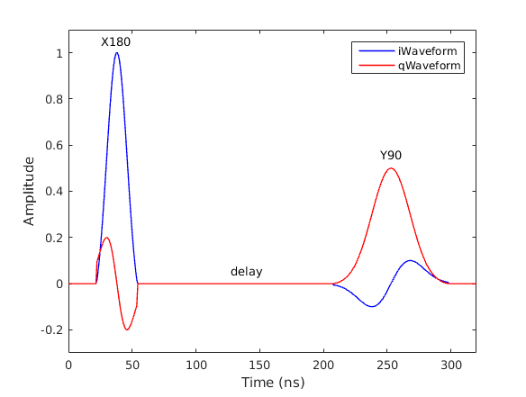
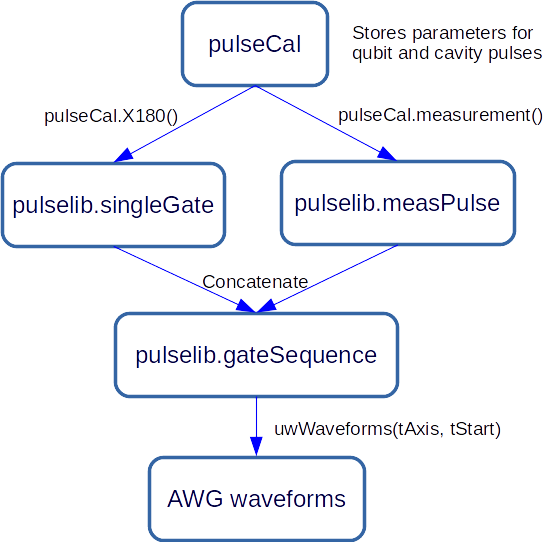
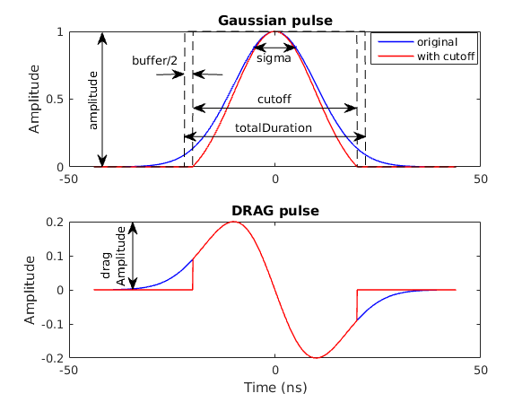
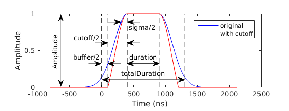

# pulselib
A library containing classes for pulse generation.

## Contents
- [Introduction](#introduction)
- [Usage](#usage)
    - [Creating gate objects](#creating-gate-objects)
    - [Creating pulse sequence](#creating-pulse-sequence)
    - [Manipulating pulse sequence](#manipulating-pulse-sequence)
    - [Generating waveforms](#generating-waveforms)
    - [Using pulseCal](#using-pulsecal)
- [Class definitions](#class-definitions)
    - [pulselib.singleGate](#-class-pulselib-singlegate-handle)
    - [pulselib.measPulse](#-class-pulselib-measpulse-handle)
    - [pulselib.delay](#-class-pulselib-delay-handle)
    - [pulselib.gateSequence](#-class-pulselib-gatesequence-handle)

## Introduction
The goal of `pulselib` is to provide **an interface between abstract qubit gates and real AWG waveforms**. Each class defines a type of gate with the relevant parameters, and can return waveforms when given the AWG's (discretized) time-axis.

One common property for all classes is `totalDuration`, which stores the total duration of the pulse and automatically updates it when parameters are changed. 

One common method for all classes is `uwWaveforms(tAxis, tStart)`, which calculates the inphase and quadrature waveforms of the pulse for the given start time and time axis.

The `pulselib.gateSequence` class concatenates gate objects to create a pulse sequence. The most useful method is `append`, which adds gate objects to the end of the sequence.

## Usage
See also the [example code](../ExampleCode/ExampleCode_pulselib.m).

### Creating gate objects
```matlab
% pi pulse along X-axis
X180 = pulselib.singleGate('X180');
X180.sigma = 8e-9;
X180.cutoff = 4*X180.sigma;
X180.dragAmplitude = 0.2;
% pi/2 pulse along Y-axis
Y90 = pulselib.singleGate('Y90');
Y90.sigma = 15e-9;
Y90.cutoff = 6*Y90.sigma;
Y90.dragAmplitude = -0.1;
% delay
delayGate = pulselib.delay(150e-9);
```
Note that `cutoff` will **NOT** update automatically when you change `sigma`. Always make sure `cutoff` is set properly to get the correct pulse shape.

### Creating pulse sequence
```matlab
gateSeq = pulselib.gateSequence();
gateSeq.append(X180);
gateSeq.append(delayGate);
gateSeq.append(Y90);
```
`gateSeq` now contains `X180`, `delay` and `Y90`:
```
>> gateSeq

gateSeq = 

gateSequence with properties:

      gateArray: {[1x1 pulselib.singleGate]  [1x1 pulselib.delay]  [1x1 pulselib.singleGate]}
  totalDuration: 2.8000e-07
   totalUnitary: [2x2 double]
```
### Manipulating pulse sequence
The [API](#-class-pulselib-gatesequence-handle) for `pulselib.gateSequence` is similar to that of a Python list. However, there is no nested list structure, so the API is simpler (for example, there is no `extend` method in addition to  `append` method). Use `append`, `insert`, `pop` and `clear` methods to manipulate `gateSeq`.
```matlab
gateSeq.append([X180, X180]);  % append two X180's to the end of sequence
gateSeq.insert(2, Y90);  % insert Y90 as the 2nd gate of sequence
gateSeq.pop([2, 5:6]);  % remove gate 2, 5 and 6 from sequence
```
To pass multiple gate objects belonging to different classes, use cell array:
```
gateSeq.append({X180, delayGate});
gateSeq.pop([4, 5]);
```

To access individual gate, use cell indexing (curly brackets):
```
>> gateSeq.gateArray{3}

ans = 

singleGate with properties:

           name: 'Y90'
        unitary: [2x2 double]
       rotation: 1.5708
        azimuth: 1.5708
      amplitude: 0.5000
  dragAmplitude: -0.1000
          sigma: 1.5000e-08
         cutoff: 9.0000e-08
         buffer: 4.0000e-09
  totalDuration: 9.4000e-08
```
### Generating waveforms
Use `uwWaveforms` method to generate waveforms for pulse sequence.
```matlab
% Time axis with sampling interval 0.8 ns
taxis = 0:0.8e-9:320e-9;  % Time axis with sampling interval 0.8 ns
tstart = 20e-9;  % Pulse sequence starts at t = 20 ns
% Call uwWaveforms method to get waveforms
[iWaveform, qWaveform] = gateSeq.uwWaveforms(taxis, tstart);
```
`iWaveform` and `qWaveform` can now be passed to AWG's.



### Using pulseCal
The [`paramlib.pulseCal`](../+paramlib/README.md#-class-paramlib-pulsecal) class
provides properties to store qubit gate parameters and methods to create gate objects. The following figure illustrates the usage of `pulseCal`, `singleGate` and `gateSequence` objects together to generate AWG waveforms.



```matlab
gatelist = {'X180', 'measurement'};  % List of gate names
pulseCal = paramlib.pulseCal();  % Create pulseCal object
gateSeq = pulselib.gateSequence();  % Create gateSequence object
taxis = 0:0.8e-9:700e-9;  % Time axis
tstart = 20e-9;  % Sequence start time

% Set up parameters in pulseCal
pulseCal.sigma = 8e-9;
pulseCal.cutoff = 4*pulseCal.sigma;
pulseCal.X180Amplitude = 1.0;
pulseCal.X180DragAmplitude = 0.2;
pulseCal.cavityAmplitude = 0.8;
pulseCal.measDuration = 0.5e-6;

% Generate gate objects by passing their names to pulseCal
% Then append them to gateSeq
for gate = gatelist
    gateSeq.append(pulseCal.(gate{:}));
end
% Insert delay between two gates
gateSeq.insert(2, pulselib.delay(50e-9));
% Generate waveforms for AWG
[iWaveform, qWaveform] = gateSeq.uwWaveforms(taxis, tstart);
```

## Class definitions
#### *class* pulselib.singleGate < handle
* **Properties**: 
  * **name** (*string*): name of the gate, can be 'X180', 'Y90', 'Identity', etc.
  * **unitary** (*2x2 array*): unitary matrix of gate
  * **rotation** (*float*): amount of rotation in radians
  * **azimuth** (*float*): angle in equator of bloch sphere and IQ plane
  * **amplitude** (*float*, between 0 and 1): amplitude of main gaussian pulse
  * **dragAmplitude** (*float*, between -1 and 1): amplitude of drag pulse in quadrature
  * **sigma** (*float*): gaussian width, in seconds
  * **cutoff** (*float*): total time of nonzero amplitude in the pulse, in seconds
  * **buffer** (*float*): buffer time between two consecutive gates, in seconds
  * **totalDuration** (*float, read-only*): total duration of gate, in seconds

* **Methods**:
  * **gate = singleGate(name, [params])**: returns an object `gate`.
  * **[iBaseband, qBaseband] = gate.uwWaveforms(tAxis, tStart)**: returns I/Q waveforms for the given time axis and start time. The waveforms are calculated as
  ```
  iBaseband = cos(azumith)*gaussian - sin(azumith)*drag;
  qBaseband = sin(azumith)*gaussian + cos(azumith)*drag;
  ```
  where `gaussian` and `drag` contain cutoff and buffer.
  * **gate.draw()**: plot the gate's waveforms.

* **Illustration**:  
  
  
#### *class* pulselib.measPulse < handle
* **Properties**:
  * **duration** (*float*): pulse length, in seconds
  * **amplitude** (*float*): amplitude of pulse
  * **azimuth** (*float*): angle in IQ plane. Default value = 0.
  * **sigma** (*float*): sigma for Gaussian ramp-up, in seconds
  * **cutoff** (*float*): (single side) cutoff for Gaussian ramp-up, in seconds
  * **buffer** (*float*): buffer time between two consecutive gates, in seconds
  * **totalDuration** (*float, read-only*): total duration of pulse, in seconds

* **Methods**:
  * **meas = measPulse(duration)**: returns an object `meas` with length `duration`.
  * **[iBaseband, qBaseband] = meas.uwWaveforms(tAxis, tStart)**: returns I/Q waveforms for the given time axis and start time.
  * **meas.draw()**: plot the pulse's waveforms.
  
* **Illustration**:  
  

#### *class* pulselib.delay < handle
**Properties**:
  * **duration** (*float*): the amount of delay, in seconds
  * **totalDuration** (*float, read-only*): same as **duration**

**Methods**:
  * **delay = delay(duration)**: returns an object `delay` with delay = `duration`.
  * **[iBaseband, qBaseband] = delay.uwWaveforms(tAxis, tStart)**: returns I/Q waveforms for the given time axis and start time.
  
#### *class* pulselib.gateSequence < handle
**Properties**:
  * **gateArray** (*cell array*): gates in the sequence
  * **totalDuration** (*float, read-only*): total duration of sequence
  * **totalUnitary** (*2x2 array*): unitary matrix of sequence

**Methods**:
  * **seq = pulselib.gateSeq([gateArray])**: returns an object `seq`. `gateArray` can be a single gate object, or an array/cell array of gate objects. When `gateArray` is missing, an empty sequence is returned.
  * **len = seq.len()**: returns the number of gates (pulselib objects) in the sequence.
  * **seq.append(gates)**: appends gate(s) to the end of the sequence.
  * **gates = seq.pop(idx)**: removes and returns the gate(s) in the sequence specified by `idx`.
  * **seq.insert(idx, gates)**: inserts gate(s) into the sequence, starting from `idx`.
  * **seq.clear()**: clears the whole sequence.
  * **[iBaseband, qBaseband] = seq.uwWaveforms(tAxis, tStart)**: returns I/Q waveforms for the given time axis and start time.
