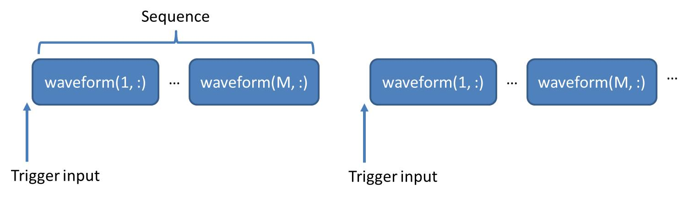

# M9330A PXI-H Arbitrary Waveform Generator
## Usage
See also the [example code](../ExampleCode/M9330A.m).
### Open instrument
```matlab
address = 'PXI50::15::0::INSTR'; % PXI address
pulsegen = M9330AWG(address);
```
### Set parameters
```matlab
% Time axis: 0.8 ns sampling interval, 30 μs total length
taxis = 0:0.8e-9:30e-6;
pulsegen.timeaxis = taxis;
% Channel 1: 1 MHz sine wave between 0 and 10 μs
pulsegen.waveform1 = sin(2*pi*1e6*taxis).*(taxis <= 10e-6);
% Channel 2: Two Gaussian pulses with σ = 100 ns, center = 5 μs and 6 μs
% A window of 8σ is used to enforce the pulse width
sigma = 100e-9;
ctr1 = 5e-6;
ctr2 = 6e-6;
pulsegen.waveform2 = exp(-(taxis-ctr1).^2/(2*sigma^2)) ...
                     .*(taxis >= ctr1-4*sigma & taxis <= ctr1+4*sigma) ...
                   + 0.5*exp(-(taxis-ctr2).^2/(2*sigma^2)) ...
                     .*(taxis >= ctr2-4*sigma & taxis <= ctr2+4*sigma);
```
### Generate waveforms
```matlab
pulsegen.AutoMarker(); % Don't forget this line before generating waveforms
pulsegen.Generate();
```
## Discussions
### Basic usage
- For basic usage, setting the properties `waveform1`, `waveform2` and `timeaxis` should be enough. They should all be 1 × N row vectors with N ≥ 128.
- The value of waveforms should be between -1 and 1. If not, it will be renormalized. In the default setup, waveform value = ± 1 correspond to output voltage = ± 0.5 V (See below for more details).
- Markers will be automatically created for non-zero values of waveforms when using `AutoMarker` method. You can also customize the markers by modifying `marker1` and `marker2`. In this case, they should be 1 × N row vectors with the same length as `waveform1`. The non-zero values in markers will be considered as marker on. The effect of **mkraddwidth** and **mkroffset** is shown in the figure below.
    <div style="text-align:center"></div>
- Trigger for the AWG needs to be fed to **trigger port 1**. Marker 1 and 2 will be automatically generated in **marker port 2 and 4**. A trigger output with width 100 ns will be generated in **marker port 1**. These ports can be varied by setting `TRIGINPORT`, `MKR1PORT`, `MKR2PORT` and `TRIGOUTPORT`. If you change these, the hardware connections needs to be changed accordingly.
- If `timeaxis` is not in the sampling rate of the instrument, the waveforms and timeaxis will be interpolated to fit the hardware sampling rate.
- Zeros will be added to the end of waveforms if the number of points are not multiple of 8.
- The maximum output voltage (corresponding to waveform value = 1) is determined by the property **OUTPUTCONFIG** (default = 2) and also frequency dependent:
    - OUTPUTCONFIG = 0: Differential output, max amplitude = 0.34 to 0.5 V
    - OUTPUTCONFIG = 1: Single-ended output, max amplitude = 0.17 to 0.25 V
    - OUTPUTCONFIG = 2: Amplified single-ended output, max amplitude = 0.34 to 0.5 V
    
### Sequence mode
In sequence mode, waveforms and markers are all M × N arrays where M is the number of **segments**. A trigger output will be generated for each **waveform**. The full sequence is shown below. Note that the AWG only wait for external trigger for each **sequence**, not between segments within the sequence.
<div style="text-align:center"></div>

### <a name="sync"/>Multiple Module Synchronization
The command `pulsegen2.SyncWith(pulsegen1)` synchronizes two M9330A modules by setting `pulsegen2` as **slave** and `pulsegen1` as **master**. Make sure the hardware connections are correct, as shown in the figure below.
<div style="text-align:center"></div>

## Class definition
#### *class* M9330AWG < handle
* **Properties**: 
  * **address** (*string*, Read-only): PXI address of the instrument
  * **instrhandle** (*object*, Read-only): AgM933x driver object to communicate with instrument
  * **samplingrate** (*float*, Read-only): Sampling rate. Default value = 1.25e9, can be reduced by factors of 2^n.
  * **timeaxis** (*float*): A row vector that defines the time axis (in unit of seconds)
  * **waveform1** (*float*): A row vector that defines channel 1
  * **waveform2** (*float*): A row vector that defines channel 2
  * **marker1** (*boolean*, Read-only): Marker for channel 1
  * **marker2** (*boolean*, Read-only): Marker for channel 2
  * **mkraddwidth** (*integer*): Extra width (in unit of samples) for markers, default value = 32
  * **mkr1offset** (*integer*): Offset for marker 1, default value = 0
  * **mkr2offset** (*integer*): Offset for marker 2, default value = 0
  * **CH1MAXAMP** (*const integer*, Private): Amplitude in raw data unit for channel 1, default value = 32767
  * **CH2MAXAMP** (*const integer*, Private): Amplitude in raw data unit for channel 2, default value = 32767
  * **TRIGINPORT** (*const integer*, Private): Port number for trigger input, default value = 1
  * **TRIGOUTPORT** (*const integer*, Private): Port number for trigger output, default value = 1
  * **MKR1PORT** (*const integer*, Private): Port number for marker 1 output, default value = 2
  * **MKR2PORT** (*const integer*, Private): Port number for marker 2 output, default value = 4
  * **OUTPUTCONFIG** (*const integer*, Private): Output mode, default value = 2
* **Methods**:
  * **pulsegen = M9330AWG(address)**: Opens the instrument with `address` and returns a `pulsegen` object
  * **pulsegen.AutoMarker()**: Automatically creates markers
  * **pulsegen.SetSampleRate(samplerate)**: Sets the sampling rate
  * **pulsegen.Generate()**: Generates waveforms
  * **pulsegen.Stop()**: Turns off waveforms
  * **pulsegen.SyncWith(mastergen)**: Synchronizes two AWG modules. See the [discussion](#sync) for details.
  * **pulsegen.GenerateRaw(waveforms, markers)**: Generates waveforms using raw data input. See the comments in the [MATLAB file](./GenerateRaw.m) for details.
  * **pulsegen.Finalize()**: Closes the instrument