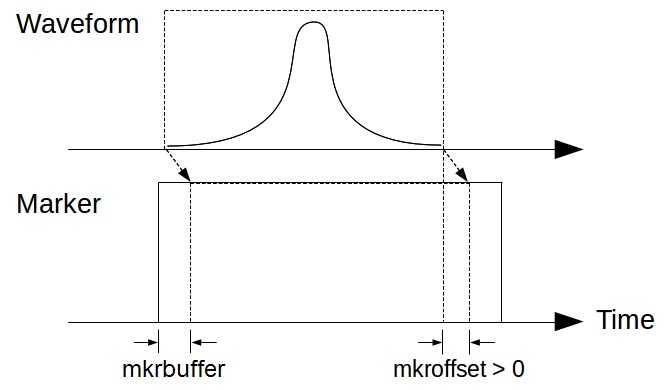
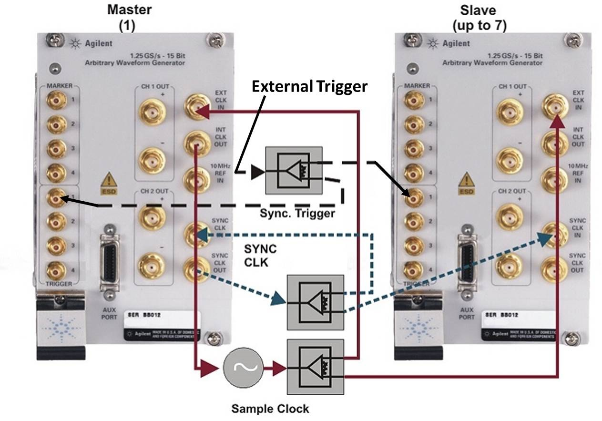

# M9330A PXI-H Arbitrary Waveform Generator
## Usage
See also the [example code](../ExampleCode/M9330A.m).
### Open instrument
```matlab
address = 'PXI50::15::0::INSTR'; % PXI address
pulsegen = M9330AWG(address);
```
### Set parameters
```matlab
% Time axis: 0.8 ns sampling interval, 30 μs total length
taxis = 0:0.8e-9:30e-6;
pulsegen.timeaxis = taxis;
% Channel 1: 1 MHz sine wave between 0 and 10 μs
pulsegen.waveform1 = sin(2*pi*1e6*taxis).*(taxis <= 10e-6);
% Channel 2: Two Gaussian pulses with σ = 100 ns, center = 5 μs and 6 μs
% A window of 8σ is used to enforce the pulse width
sigma = 100e-9;
ctr1 = 5e-6;
ctr2 = 6e-6;
pulsegen.waveform2 = exp(-(taxis-ctr1).^2/(2*sigma^2)) ...
                     .*(taxis >= ctr1-4*sigma & taxis <= ctr1+4*sigma) ...
                   + 0.5*exp(-(taxis-ctr2).^2/(2*sigma^2)) ...
                     .*(taxis >= ctr2-4*sigma & taxis <= ctr2+4*sigma);
```
### Generate waveforms
```matlab
pulsegen.Generate();
```
## Discussions
### Basic usage
- For basic usage, setting the properties `waveform1`, `waveform2` and `timeaxis` should be enough. They should all be 1 × N row vectors and the pulse duration should be longer than 128/(sampling rate). The waveforms will be generated in channel 1 and 2 every time an external trigger is received.
- The values of waveforms should be between -1 and 1. If not, they will be normalized. In default setup (OUTPUTCONFIG = 2), waveform value = ± 1 correspond to output voltage = ± 0.5 V (See the discussion of **OUTPUTCONFIG** below for details).
- When `mkrauto = 1`, **marker 2/4** will be automatically created for non-zero values of **waveform 1/2** and **marker 1** will be a trigger at the start of each waveform. **marker 3** can be customized for your purpose and has to be of the same length as the timeaxis and waveforms. The properties **mkrbuffer** and **mkroffset** are integers in unit of raw samples. Their effect is shown in the figure below.
    <div style="text-align:center"></div>
- When `mkrauto = 0`, all markers need to be provided manually and should be row vectors with the same length as `waveform1`. The non-zero values in markers will be considered as marker on.  **mkrbuffer and mkroffset have no effect**.
- Trigger for the AWG needs to be fed to **TRIGINPORT (default = 1)**.
- If `timeaxis` is not in the sampling rate of the instrument, the waveforms and timeaxis will be interpolated to fit the hardware sampling rate.
- Zeros will be added to the end of waveforms if the number of points are not multiple of 8.
- The maximum output voltage (corresponding to waveform value = 1) is determined by the property **OUTPUTCONFIG** (default = 2) and also frequency dependent:
    - OUTPUTCONFIG = 0: Differential output, max amplitude = 0.34 to 0.5 V
    - OUTPUTCONFIG = 1: Single-ended output, max amplitude = 0.17 to 0.25 V
    - OUTPUTCONFIG = 2: Amplified single-ended output, max amplitude = 0.34 to 0.5 V
 
### <a name="sync"/>Multiple Module Synchronization
The command `pulsegen2.SyncWith(pulsegen1)` synchronizes two M9330A modules by setting `pulsegen2` as **slave** and `pulsegen1` as **master**. Make sure the hardware connections are correct, as shown in the figure below.
<div style="text-align:center"></div>

## Class definition
#### *class* M9330AWG < handle
* **Properties**: 
  * **address** (*string*, Read-only): PXI address of the instrument
  * **instrhandle** (*object*, Read-only): AgM933x driver object to communicate with instrument
  * **samplingrate** (*float*): Sampling rate. Default value = 1.25e9, can be reduced by factors of 2^n.
  * **timeaxis** (*float*): Row vector that defines the time axis (in unit of seconds)
  * **waveform1** (*float*): Row vector that defines channel 1
  * **waveform2** (*float*): Row vector that defines channel 2
  * **marker1** (*float*): Row vector that defines marker 1
  * **marker2** (*float*): Row vector that defines marker 2
  * **marker3** (*float*): Row vector that defines marker 3
  * **marker4** (*float*): Row vector that defines marker 4
  * **mkrauto** (*integer*): Turns on/off automatic marker, default value = 1
  * **mkrbuffer** (*integer*): Extra width (in unit of raw samples) for markers, default value = 32
  * **mkroffset** (*integer*): Offset (in unit of raw samples) for markers, default value = 0
  * **TRIGINPORT** (*integer*): Port number for trigger input, default value = 1
  * **OUTPUTCONFIG** (*integer*): Output mode, default value = 2
* **Methods**:
  * **pulsegen = M9330AWG(address)**: Opens the instrument with `address` and returns a `pulsegen` object
  * **pulsegen.SetSampleRate(samplerate)**: Sets the sampling rate
  * **samplerate = GetSampleRate(self)**: Gets the sampling rate
  * **pulsegen.Generate()**: Generates waveforms
  * **pulsegen.Stop()**: Turns output off
  * **pulsegen.SyncWith(mastergen)**: Synchronizes two AWG modules. See the [discussion](#sync) for details.
  * **pulsegen.GenerateRaw(waveforms, markers)**: Generates waveforms using raw data input. See the comments in the [MATLAB file](./GenerateRaw.m) for details.
  * **s = pulsegen.Info()**: Displays and returns *string* `s` for instrument information
  * **pulsegen.Finalize()**: Closes the instrument