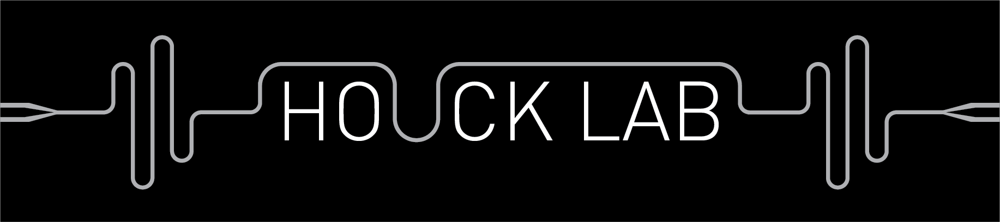
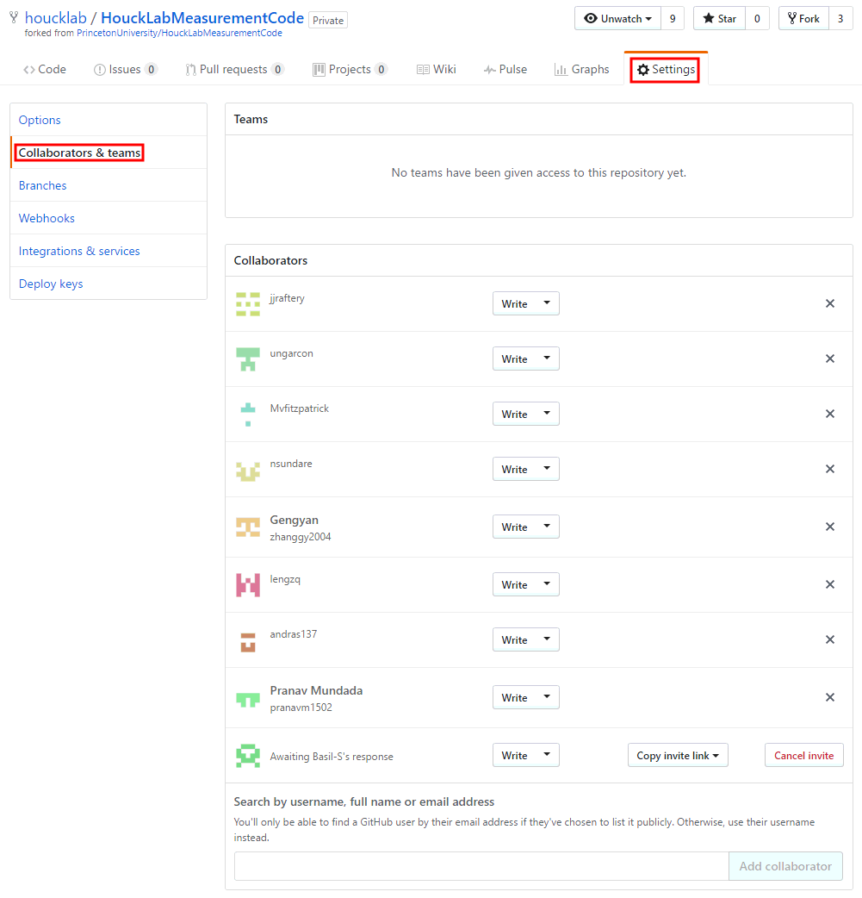
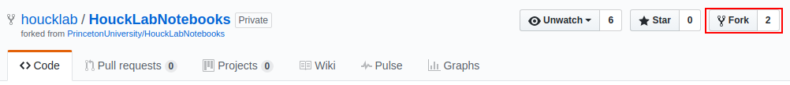

## Contents
- [Introduction](#introduction)
- [Installation and maintanence](#installation-and-maintanence)
- [Usage](#usage)
- [Remarks](#remarks)
- [Search path and namespace](#search-path-and-namespace)
- [Documentation](#documentation)
- [Useful links](#useful-links)

## Introduction
This is the MATLAB code for communication with measurement equiqments in Houck Lab. 

The goal is to encapsulate the lower level equiment codes and provide a unified interface for measurements.
Equipment-indepdent programs can then be built with these interfaces.
Update and maintanence of the code will be done through GitHub.

## Installation and maintanence
All measurement computers use houcklab GitHub account.

For your own PC, it is suggested to use your own GitHub account and add it as a collaborator. To do this, first log in as *houcklab*, and then go to *Settings -> Collaborators & terms*.



After that, log in using your user account and **fork** the repository.



You should see *HouckLabMeasurementCode* appearing in your repositories. To download the code, navigate to a destination folder and use `git clone`:
```
$ cd YourDestFolder
$ git clone https://github.com/YourAccount/HouckLabMeasurementCode.git
```
Then add the houcklab repository as a remote upstream:
```
git remote add houcklab https://github.com/houcklab/HouckLabMeasurementCode.git
```
Now you should have `origin` as your own forked repository and `houcklab` as the upstream repository. You can use
```
git push origin master
git pull houcklab master
```
and so on to sync with remote nodes.

When writing **commit messages**, please include your name and a short title, followed by a new line and more detailed information, e.g.

> YourName - Update measlib

> Update +measlib/README.md and ExampleCode/ExampleCode_measlib.m

Check [git cheat sheet](./Reference/git-cheat-sheet.pdf) or any online tutorial to learn more about git.

## Usage
Before using the code, run [setpath.m](./setpath.m) to set the search path.

A typical usage of the code to communicate with an instrument involves **opening instrument**, **setting parameters**,  **getting data** and **closing instrument**.

For example, to communicate with a YOKOGAWA GS200 voltage/current source, first create a **YOKOGS200** object using its GPIB address:
```matlab
address = 'GPIB0::2::0::INSTR';
yoko = YOKOGS200(address);
```
Then set up the parameters:
```matlab
yoko.rampstep = 0.002;      % Voltage increment for each step
yoko.rampinterval = 0.01;   % Time interval between 2 steps
```
To set the voltage, call the `SetVoltage` method:
```matlab
yoko.SetVoltage(0.5);
```
Alternatively, you can use an assignment
```matlab
yoko.voltage = 0.5;
```
to directly set the voltage.

To get the current output voltage, call the `GetVoltage` method:
```matlab
voltage = yoko.GetVoltage();
```
or use a direct assignment:
```matlab
voltage = yoko.voltage;
```
To close the instrument, use the `Finalize` method:
```matlab
yoko.Finalize();
```

The code can be used in various ways depending on your own preference.

In [instruments_initialize.m](./instruments_initialize.m), all the instrument objects are declared as *global* variables:
```matlab
global pnax;
address = 'GPIB0::16::0::INSTR';
pnax = PNAXAnalyzer(address);
```
The global property just makes it easy to access them inside other functions, but it is **not** mandatory. You can define them as normal variables as well.

1.  To use them in a script or function:
    ```matlab
    global pnax;
    display(pnax.params);
    ```
    
2.  To pass them to a function as an input parameter:
    ```matlab
    function data = MyMeasurement(argument1, ..., pnax)
        ...
        pnax.PowerOn();
        data = pnax.Read();
        ...
    end
    ```
    
3.  You can define your own classes that have `pnax` as a property, or pass `pnax` to your class methods.

## Remarks
1.  All instrument objects are **handle** objects. See [Comparison of Handle and Value Classes](http://www.mathworks.com/help/matlab/matlab_oop/comparing-handle-and-value-classes.html) for more details.
2.  **Property set/get methods** are used for most instrument classes. For example, in [YOKOGS200.m](./@YOKOGS200/YOKOGS200.m) we define
    ```matlab
    function set.voltage(yoko, voltage)
        SetVoltage(yoko, voltage);
    end
    ```
and this allows us to use `yoko.voltage = 0.5` and `yoko.SetVoltage(0.5)` interchangably. Similarly,  `voltage = yoko.voltage` and `voltage = yoko.GetVoltage()` are the same. See the following links for reference.

  [Property Set Methods](http://www.mathworks.com/help/matlab/matlab_oop/property-set-methods.html)
  
  [Property Get Methods](http://www.mathworks.com/help/matlab/matlab_oop/property-get-methods.html)

3.  Loading a class object from a .mat file requires that **the class definition file exists and is on the matlab search path**. For more convenient usage, you can save the object to a struct (this will cause a warning):
    ```matlab
    s = struct(obj);
    save('data.mat', 's');
    ```
    Each property of the object will become a field of the struct.

    A `toStruct` method is implemented for classes in **paramlib**. For example,
    ```matlab
    pnaxparams = pnax.params.toStruct();
    save('pnaxsettings.mat', 'pnaxparams');
    ```
    will convert the current PNAX configuration to a struct and save it to a .mat file.

## Search path and namespace
In order for the code to work consistently, we need a well defined search path and namespace. The [setpath.m](./setpath.m) script adds **only the root folder** of the repository to MATLAB search path. Be careful with the namespace when you add subfolders or your own code folders to the search path. In particular, **do not** add subfolders of the repository to the search path.

All the classes for instruments are located directly under the root folder, in **class folders** starting with '@'. Other classes and functions are contained in **package folders** (and subfolders) starting with '+'.

A package folder that contains classes and functions would have a structure like this:
```
RepoRoot\+MyPackage1\MyClass1.m % A single class file
                    \@MyClass2\MyClass2.m % A class folder that has methods defined in seperate files
                              \MyMethod.m
                    \+MyPackage2\MyFunc.m % A function
```
When you add **ONLY** `RepoRoot` folder to MATLAB search path, you can access the above classes and functions like this:
```
obj1 = MyPackage1.MyClass1();
obj2 = MyPackage1.MyClass2();
obj2.MyMethod();
result = MyPackage1.MyPackage2.MyFunc(args);
```
You can also use `import` to call the classes and functions more conviently:
```matlab
import MyPackage1.MyClass1
import MyPackage1.MyPackage2.*

obj1 = MyClass1();
result = MyFunc(args);
```
The `import` statement should only be used inside functions (not in a script), so that the namespace is only effective within the range of the function.

Check the following links for more explanation.
- [Packages Create Namespaces](http://www.mathworks.com/help/matlab/matlab_oop/scoping-classes-with-packages.html)
- [Folders Containing Class Definitions](http://www.mathworks.com/help/matlab/matlab_oop/organizing-classes-in-folders.html)
- [Methods In Separate Files](http://www.mathworks.com/help/matlab/matlab_oop/methods-in-separate-files.html)
- [Add package or class to current import list](http://www.mathworks.com/help/matlab/ref/import.html)

## Documentation
Check [markdown cheat sheet](./Reference/markdown-cheat-sheet.pdf) or online tutorials for typesetting documents using markdown.

### Instruments
- [GPIB instrument](./@GPIBINSTR/README.md)
- [E8267D microwave generator](./@E8267DGenerator/README.md)
- [PNAX network analyzer](./@PNAXAnalyzer/README.md)
- [YOKOGAWA GS200 voltgae/current source](./@YOKOGS200/README.md)
- [YOKOGAWA 7651 voltage/current source](./@YOKO7651/README.md)
- [U1082A digitizer](./@U1082ADigitizer/README.md)
- [U1084A digitizer](./@U1084ADigitizer/README.md)
- [M9703A digitizer](./@M9703ADigitizer/README.md)
- [M9330A arbitrary waveform generator](./@M9330AWG/README.md)
- [33250A 80 MHz waveform generator](./@AWG33250A/README.md)
- [Holzworth HS9000 RF synthesizer](./@HolzworthHS9000/README.md)
- [SignalCore SC5511A RF signal source](./@SignalCoreSC5511A/README.md)
- [LabBrick signal generator](./@LabBrick/README.md)

### Libraries
- [measlib](./+measlib/README.md)
- explib
- [pulselib](./+pulselib/README.md)
- [paramlib](./+paramlib/README.md)
- funclib
- plotlib

### Other documents
- [Qubit gate calibration and randomized benchmarking](./+measlib/GateCalib&RB.md)
- [Single-qubit Clifford gates](./+measlib/SingleQubitCliffords.pdf)
- [Two-qubit Clifford gates](./+measlib/TwoQubitCliffords.pdf)

## Useful links
- [BBN-Q](https://github.com/BBN-Q/Qlab/tree/develop/common/%2BdeviceDrivers): MATLAB code for hardware
- [Labber](https://github.com/Labber-software/Drivers): Python code for hardware
- [SLAB](https://github.com/SchusterLab/slab): Schuster lab code base
